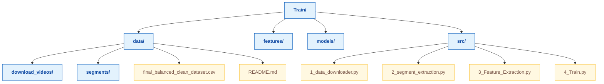
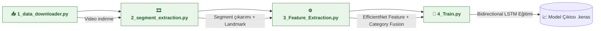

# 🧠 Train Modülü

Otizm tespit modeli eğitim pipeline’ını içerir.  
Bu yapı, videoların indirilmesinden başlayarak segment çıkarımı, özellik üretimi ve model eğitimi aşamalarını kapsar.

---

## 📁 Klasör Yapısı

---
## 🔁 Eğitim Akışı (Pipeline)

## 📚 Aşama Açıklamaları

### 🟦 1️⃣ Veri İndirme (`1_data_downloader.py`)

Bu aşama, modelin eğitiminde kullanılacak ham videoları toplar.

- **Kaynaklar:** YouTube & Instagram bağlantıları (`video_links.csv`)
- **Kütüphane:** `yt-dlp`
- **Çıktılar:**
  - `data/download_videos/` içinde `.mp4` dosyaları
  - Başarısız indirmeler: `failed_videos.csv`
- **Özellikler:**
  - İndirilen videolar `category` etiketiyle eşleştirilir (Healthy / Autism)
  - Yeniden indirilmeyi önlemek için var olan dosyalar atlanır
  - Hata yönetimi yapılır (bağlantı hataları, format sorunları vs.)

🧠 *Amaç:* Modelin çeşitli kategorilerden, dengeli sayıda örnekle beslenmesini sağlamak.

---

### 🟩 2️⃣ Segment Çıkarımı (`2_segment_extraction.py`)

Bu aşama, her videoyu sabit uzunlukta **segmentlere** böler ve her karedeki **landmark** bilgilerini çıkarır.

- **Kütüphane:** `MediaPipe Holistic`  
  (Pose, Hands, FaceMesh modelleri)
- **İşlem:**
  1. Videoyu `fps` (varsayılan 30) üzerinden karelere böler.
  2. Her 2 saniyelik aralık bir segment oluşturur.
  3. Her karede:
     - **El hareketi (Hand Motion)**  
     - **Kafa hareketi (Head Motion)**  
     - **Göz kırpma (Blink)**  
     - **Spinning / Dönme hareketi**
     tespit edilir.
- **Çıktılar:**
  - Landmark koordinatları `.npy` olarak `data/segments/` dizinine kaydedilir.
  - Her segment için meta bilgiler (zaman, frame sayısı, kategori)

🧩 *Amaç:* Görsel davranış örüntülerini küçük analiz birimlerine ayırmak.

---

### 🟨 3️⃣ Özellik Çıkarımı (`3_Feature_Extraction.py`)

Bu aşama, her segment için **görsel özellikleri** çıkarır ve **landmark verileriyle birleştirir.**

- **Kütüphaneler:**  
  `TensorFlow`, `Keras`, `EfficientNetB0`, `NumPy`, `Pandas`
- **İşlem:**
  1. Segment kareleri `224x224` boyutuna getirilir.
  2. `EfficientNetB0` (ImageNet ağırlıklarıyla) çıkarım (feature extraction) yapar.
  3. Ortaya çıkan **feature vektörü**, aynı segmentteki **landmark özellikleri** ile birleştirilir.
  4. Elde edilen birleşik tensör `.npy` olarak kaydedilir.
  5. Dataset:
     - **%70 Train**
     - **%15 Validation**
     - **%15 Test**
     oranında bölünür.
- **Çıktılar:**
  - `features/X_train.npy`, `X_val.npy`, `X_test.npy`
  - `features/y_train.npy`, `y_val.npy`, `y_test.npy`

🔍 *Amaç:* Görsel (EfficientNet) + Davranışsal (MediaPipe) verileri tek vektörde birleştirmek.

---
# 4️⃣ Model Eğitimi (AutismDetectionTrainer)

Son aşamada zaman serisi özellikleriyle çalışan **Bidirectional LSTM modeli** eğitilir.

## Model Mimarisi
- **Masking:** 0’larla doldurulmuş frame’leri yoksayar  
- **Bidirectional LSTM:** 64 birim → 32 birim, 2 katman  
- **BatchNormalization:** LSTM katmanlarından sonra  
- **Dense Katmanları:** Dense(32) + Dropout + Dense(1, sigmoid)  
- **Kayıp Fonksiyonu:** `binary_crossentropy`  
- **Optimizasyon:** Adam (lr=1e-4)  
- **Metrikler:** accuracy, precision, recall, AUC  

## Veri İşleme
- NaN değerler otomatik temizlenir  
- Train set’e hafif Gauss gürültüsü eklenir (data augmentation)  

## Callback’ler
- EarlyStopping (`val_loss` izlenir, `patience=8`)  
- ReduceLROnPlateau (`val_loss` izlenir, `patience=4`, `factor=0.5`)  
- ModelCheckpoint (`val_accuracy` en yüksek epoch kaydedilir)  

## Threshold Arama
- Test set’inde 0.1–0.9 arası F1-score hesaplanır  
- En iyi threshold otomatik belirlenir  

## Model Kaydı
- En iyi epoch çıktısı `autism_detection_model_YYYYMMDD_HHMMSS.keras` olarak kaydedilir  
- Eğitim geçmişi `training_history_YYYYMMDD_HHMMSS.npy` olarak saklanır  
- Model bilgileri `model_info_YYYYMMDD_HHMMSS.pkl` dosyasına yazılır  

## Amaç
Segment tabanlı analizleri birleştirip, genel otizm tespit olasılığını tahmin etmek.

---

## 🧪 Özet Akış

1. **Video indir** → 2. **Segment oluştur** → 3. **Özellik çıkar** → 4. **Model eğit**  
2. **Model performansı** ve **threshold değeri** raporlanır.  
3. **En iyi model** `.keras` olarak `models/` dizinine kaydedilir.

---

> 💡 *İpucu:*  
> Pipeline sırasıyla çalıştırılmalıdır.  
> Eğer veriler önceden çıkarılmışsa, 3. veya 4. adımdan devam edilebilir.

---
## 🧪 Çıktılar

- **`data/download_videos/`** → YouTube ve Instagram’dan indirilen ham videolar, etiket klasörlerine göre ayrılmış.  

- **`data/segments/`** → Videolardan çıkarılmış segmentler ve normalizasyon uygulanmış landmark’lar (`.npy` formatında).  

- **`data/features/`** → EfficientNet tabanlı feature’lar, segment ve category bilgileriyle birleştirilmiş.  

- **`models/`** → Eğitilmiş LSTM modelleri, model bilgileri ve eğitim geçmişi (`.keras`, `.pkl`, `.npy`) dosyaları.

---
## 🧩 Kullanılan Teknolojiler

| Teknoloji | Amaç |
|-----------|------|
| **Python 3.10+** | Temel çalışma ortamı |
| **TensorFlow / Keras** | Derin öğrenme modeli ve LSTM yapısı |
| **MediaPipe** | Landmark çıkarımı (yüz, el, poz) |
| **OpenCV** | Görüntü okuma ve işleme |
| **yt-dlp** | YouTube ve Instagram video indirme |
| **NumPy / Pandas** | Veri işleme |
| **scikit-learn** | Train/Val/Test bölme ve metrikler |
| **Matplotlib** | Eğitim sonuçlarının görselleştirilmesi |

